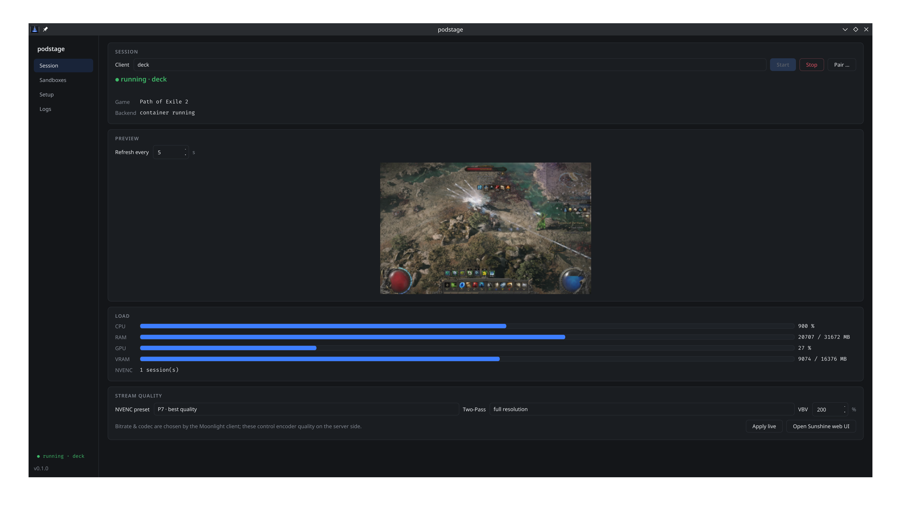
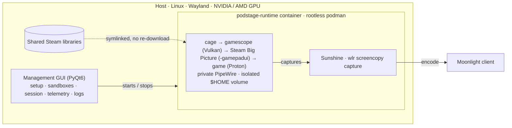
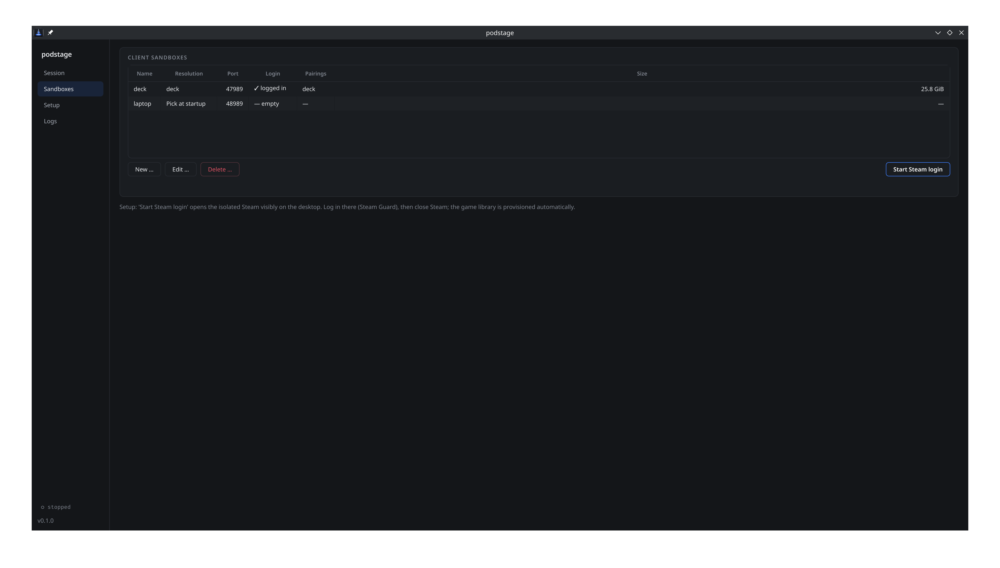
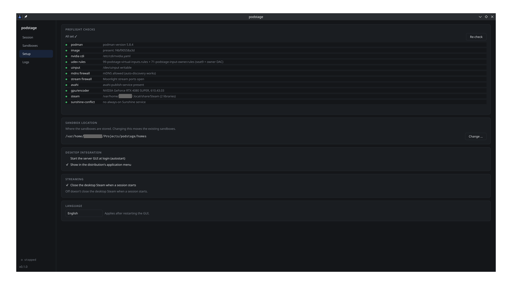

# podstage

**Play a game streamed to your Steam Deck (or any Moonlight client) while your
desktop keeps doing its own thing.**

podstage runs each stream as a headless, isolated Steam Big Picture session
inside a container: its own display, its own audio, its own Steam login and
settings, but shared game downloads with your main install. The game renders on
a virtual [gamescope](https://github.com/ValveSoftware/gamescope) display and
[Sunshine](https://github.com/LizardByte/Sunshine) captures only that session.
Streaming to the couch never takes over your monitors, your sound, or your
Steam config.

It is built for one powerful gaming PC that you want to play from the couch, a
laptop, or a Steam Deck, controller in hand, with Steam's Big Picture UI on the
screen. A small PyQt6 management GUI on the host does the rest: it walks you
through the one-time setup, creates and logs in the per-client sandboxes, then
starts, monitors, and tunes the stream. No config files to edit.



## How it started

The idea came on the couch: my gaming PC playing YouTube on the TV while I
played a game on the Steam Deck, graphics down, fan roaring, FPS fluctuating. The
powerful machine sat idle while the little one did the hard work.

## Why not just Steam Remote Play or plain Sunshine?

Both mirror your actual desktop session. Streaming to another room takes over
the screen you are sitting at, grabs the audio, and shares one set of Steam
settings and one logged-in account's input. podstage spins up a separate,
invisible session instead:

- The desktop keeps its monitors, audio, and Steam settings untouched. You can
  use it as usual while someone streams a game: YouTube, Plex, music, work.
  (By default the desktop Steam client closes when a stream starts. You can turn
  that off in Setup to keep it running, e.g. to stream from a second Steam
  account while you keep playing on the desktop.)
- Input from the client stays inside the streaming session and cannot reach
  the desktop, or the other way around.
- Each client gets a persistent sandbox with its own Steam settings, Steam
  Input layout, and per-game graphics presets.

## Related projects

[Games on Whales / Wolf](https://github.com/games-on-whales/wolf) is a
multi-client streaming platform built on the same isolation idea;
[Apollo](https://github.com/ClassicOldSong/Apollo) (a Sunshine fork) gives each
client its own virtual display on Windows. podstage has a narrower scope: one
Linux gaming PC, one client at a time, Steam Big Picture, managed from a small
host GUI.

## Features

- **Headless isolated session.** `cage` → `gamescope` (Vulkan) → Steam
  `-gamepadui`, captured by a bundled Sunshine (wlr screencopy, hardware encode
  via NVENC or VAAPI). No window on the host, no DRM output.
- **Built for Steam, driven by controller.** The streamed session is Big
  Picture, navigated and played entirely by gamepad; Steam Input works
  natively. Client keyboard/mouse input is deliberately not injected, and
  non-Steam launchers aren't wired up.
- **Shared games, separate prefixes.** Game files are symlinked from your main
  Steam libraries, so nothing is downloaded twice. The libraries are mounted
  as read-only overlay lowerdirs: a session can never modify host game
  files; its writes land in per-sandbox overlay storage. Prefixes and saves
  stay per sandbox.
- **Input isolation.** The client's virtual input devices live on a dedicated
  seat (udev rules plus a small `libseat` shim) and never touch the desktop.
  This isolates input routing, not malware: processes running as your user
  keep their usual `uinput` access, as on any gaming distro.
- **Per-client sandboxes.** One isolated `$HOME` per client, created and
  Steam-logged-in from the GUI.
- **Light host footprint.** No daemons, no system services, nothing running as
  root; the container runs as your user. Setup installs two udev rules, the
  only sudo podstage ever needs.
- **Management GUI.** One-click setup fixes, sandbox management, live
  CPU/GPU/VRAM/encoder telemetry, a stream preview, pairing, and encoder
  quality settings that follow the GPU (NVENC or VAAPI).
- **English and German UI**, following the system locale (override in the
  Setup panel or via `PS_LANG`).

## Requirements

- Linux with a Wayland desktop. Developed on Bazzite-DX (Fedora-based, KDE
  Plasma); other modern distros should work.
- podman
- A GPU with hardware video encode: NVIDIA (NVENC, via CDI injection) or AMD
  (VAAPI, via `/dev/dri`). The GUI adapts its encoder controls and telemetry to
  the detected vendor. NVIDIA has the most testing; the AMD path is validated on
  one iGPU.
- Steam installed on the host; its libraries are shared into the sandboxes.
- Python ≥ 3.11 for the CLI/core, PyQt6 ≥ 6.6 for the GUI (`./ui.sh` tries to find a suitable interpreter).
- A Moonlight client with a gamepad (Steam Deck, laptop, phone with
  controller).

> **Tested configuration.** podstage is developed and verified end-to-end on
> Bazzite-DX 43 (Fedora 43, KDE Plasma, Wayland), Ryzen 7 7800X3D, NVIDIA RTX
> 4080 SUPER (driver 610.43), streaming to a Steam Deck LCD. The AMD/VAAPI path
> has additionally been validated end-to-end on a Bazzite-DX laptop with a
> Rembrandt iGPU (Ryzen 7035 class), also streaming to a Steam Deck. It should
> work on other Fedora/Bazzite/Arch-based hosts; treat other distros and
> non-KDE compositors as untested (see [Portability](#portability)). Bug
> reports from other setups are very welcome.

## Quick start

```bash
git clone https://github.com/slooock-dev/podstage && cd podstage
python3 -m venv .venv && . .venv/bin/activate   # Fedora/Bazzite are PEP 668
pip install -e '.[ui]'          # core + CLI + management GUI

# 1. Build the runtime image (~2.5 GB, self-contained), run from the repo root
podman build -t podstage-runtime:latest containers/runtime/

# 2. Launch the management GUI
./ui.sh
```

> Sunshine's web UI is reachable on your LAN. Its login is generated randomly
> per install (there is no default credential), and streaming requires the
> Moonlight pairing PIN. See [Security notes](#security-notes).

Then, in the GUI:

1. **Setup**: work top to bottom. Each red/amber check has a fix button;
   root-gated ones open a pkexec prompt. Build the image, install the two udev
   rules, open the mDNS firewall port. Everything after setup runs without a
   password.
2. **Sandboxes**: create a client profile (name, resolution, Sunshine port),
   then click *Start Steam login*. An isolated Steam opens on the desktop, you
   log in, close it, and the game library is provisioned automatically.
3. **Session**: pick the client, *Start*, then *Pair* with the PIN Moonlight
   shows. Connect from Moonlight and play.

Prefer the terminal? `podstage doctor` validates the environment, `podstage
setup` prints the guided commands, and `podstage runtime start --home
homes/deck` runs a container directly. See [CLI](#cli).

## Architecture



- One active session at a time; the runtime enforces that.
- The client's virtual input devices live on a dedicated seat and stay
  isolated from the desktop in both directions.
- The container runs as your user.

What is baked into the image vs. mounted at runtime, the exact run flags, and
how input hotplug works inside the container is documented in
[`containers/runtime/README.md`](containers/runtime/README.md).

## Security notes

Everything runs as your user; after the one-time setup, nothing needs root. The
container is a compatibility sandbox, not a security boundary: it shares your
network and the real `/dev/uinput`. Your Steam libraries are read-only overlay
lowerdirs, so a hostile game cannot modify host game files and its writes stay
in per-sandbox storage. Otherwise treat games with the same trust you would
on the desktop.

Sunshine is reachable on your LAN; its web-UI login is random per install and
streaming needs the Moonlight pairing PIN. The image is built locally
(digest-pinned base, sha256-verified Sunshine).

## GUI overview

| Page | What it does |
|------|--------------|
| **Session** | Start/stop the stream, the active game, CPU/GPU/VRAM/encoder meters, a live preview, pairing, and encoder quality settings (NVENC or VAAPI depending on the GPU). |
| **Sandboxes** | Client profiles, per-sandbox status (login, paired clients, disk size), the visible Steam-login bootstrap. |
| **Setup** | Doctor checks with one-click fixes, the one-time udev rules install, desktop integration, UI language. |
| **Logs** | Live journald tail of the runtime container. |

<p align="center">
  
  
</p>

The GUI needs PyQt6; everything else runs under any Python ≥ 3.11. `./ui.sh`
selects the interpreter (`$PS_QT_PYTHON` if set, otherwise the first of
`python3`, `python`, Homebrew's `python3` that can `import PyQt6`) and points
Qt's plugin path at PyQt6's bundled `Qt6/plugins`, falling back to Homebrew's
`qtbase` plugins (`$QT_PLUGIN_PATH` overrides).

## Image quality

The encoder controls on the Session page (NVENC preset, two-pass and VBV on
NVIDIA; the VAAPI quality profile and rate control on AMD) only decide how well
the encoder spends the bitrate it is given. The bigger wins are on the client
and the network:

- **Raise the Moonlight bitrate.** Sunshine streams whatever the client
  requests, and Moonlight's default of 10–20 Mbps is low. On a LAN, try
  50–100+ Mbps. A washed-out, blocky picture in motion is almost always too
  little bitrate.
- **Prefer HEVC or AV1** over H.264 (Moonlight → Settings → Video codec). At
  the same bitrate HEVC looks noticeably better, AV1 better still. NVIDIA
  encodes all three; AMD covers H.264 and HEVC, with AV1 on newer GPUs.
- **Match the resolution 1:1.** Set Moonlight to the client's native
  resolution and use a matching podstage profile (e.g. `1280x800` for a Steam
  Deck LCD), so nothing is scaled.
- **Prefer a wired host.** High bitrate over Wi-Fi suffers from packet loss.
  Wiring the host, or a clean 5 GHz link, often helps more than any encoder
  setting.

After that, tune the encoder on the Session page: on NVIDIA, max the preset
(P7) and two-pass (full res), and raise VBV if fast motion still shows
artifacts; on AMD, raise the VAAPI quality profile.

## CLI

```
podstage doctor                    # validate the environment
podstage setup                     # print guided (sudo) setup commands
podstage runtime start|stop|status # drive the container directly (by HOME dir)
podstage session list|start|stop|status <name>
podstage provision <app_id> <session>
```

`podstage runtime start --home homes/deck --resolution 1280x800@60` is what
`containers/runtime/run.sh` wraps.

## Portability

podstage is developed on Fedora/Bazzite, and a few host assumptions reflect
that:

- The 32-bit NVIDIA GL libraries and the Xwayland GLX module are bind-mounted
  from the host by absolute path. podstage searches the Fedora/Bazzite/Arch and
  Debian/Ubuntu locations; a distro that stores them elsewhere would leave
  Steam's 32-bit client UI without hardware GL.
- CDI GPU injection expects a spec at `/etc/cdi/nvidia.yaml`
  (`nvidia-ctk cdi generate`).
- AMD uses `/dev/dri` and VAAPI instead of CDI/NVENC. The GUI follows suit:
  the Session page shows VAAPI encoder controls (quality, rate control) instead
  of NVENC ones, and reads GPU load / VRAM from the amdgpu sysfs
  (`gpu_busy_percent`, `mem_info_vram_*`) since there is no `nvidia-smi`. This
  path is validated on one AMD Rembrandt iGPU (streamed to a Steam Deck); it has
  had less testing than the NVIDIA path.

Patches widening distro and GPU support are very welcome.

## Troubleshooting

- **Big Picture is a black or flashing screen.** Steam's CEF needs ~450 MB of
  shared memory; podman's default `/dev/shm` is 64 MB, which crash-loops the
  renderer. The runtime sets `--shm-size=1g`. Keep it.
- **Client input controls the desktop, or the stream has no input.** Both udev
  rules must be installed: the seat rule pins the streaming devices to a
  dedicated seat, the generated owner rule makes them and `/dev/uinput`
  accessible to the container. Install both from the Setup page. If
  `/dev/uinput` stays unwritable afterwards, run
  `sudo udevadm trigger --sysname-match=uinput`.
- **Custom Proton (GE / CachyOS) hangs at launch** with a "non-Gamescope
  swapchain … hooking has failed" dialog. Nested gamescope fails GE's stricter
  WSI hook, so the runtime sets `DISABLE_GAMESCOPE_WSI=1` (capture goes through
  wlr, the bypass isn't needed). `PS_GAMESCOPE_WSI=enabled` opts back in.
- **Moonlight can't auto-discover the host.** Open mDNS in the firewall
  (`firewall-cmd --add-service=mdns`, offered as a Setup fix). Pairing by IP
  always works.
- **NVIDIA `vulkan_make_output failed` on start.** The CDI spec doesn't inject
  `/dev/nvidia-modeset`; the runtime adds it explicitly. Regenerating CDI
  (`nvidia-ctk cdi generate`) also fixes it.
- **The preview stays blank.** The in-container capture only produces a frame
  while the Big Picture UI is actually animating.
- **A game re-downloads the same update in every session.** Sandbox-side
  updates live in per-sandbox overlay storage
  (`~/.local/share/podstage/overlays/`) and are purged once the host updates
  the game past the sandbox. Update games on the host.

Live container logs: `journalctl -f CONTAINER_NAME=podstage-runtime`.

## Uninstall

`podstage uninstall` (or Setup → *Remove podstage*) detects and removes
everything setup created: udev rules, firewall ports, the runtime image,
sandboxes, data and configuration. Shared pieces (the mDNS firewall service,
the NVIDIA CDI spec) are kept unless `--all`, since other software uses them too.

## Development

See [CONTRIBUTING.md](CONTRIBUTING.md) for the dev setup, the Qt/Python quirk
for the GUI, and the test workflow.

## A note on how this was built

podstage was built in collaboration with AI coding assistants, human-in-the-loop
throughout: every change was directed, reviewed, tested, and verified on real
hardware by a human maintainer before landing. The AI accelerated the work; the
engineering decisions, quality assurance, and end-to-end validation are human.

## License

MIT, see [LICENSE](LICENSE).
