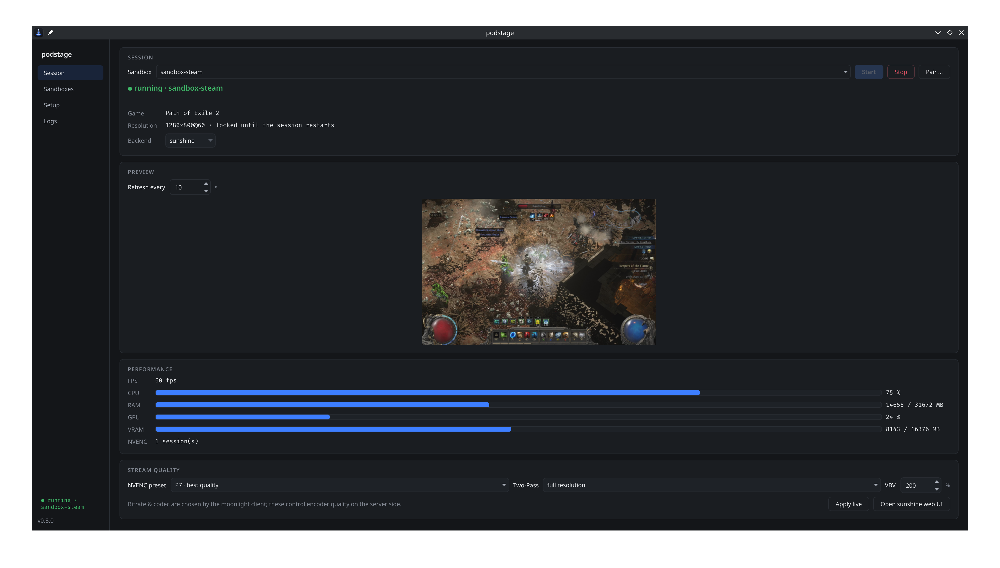
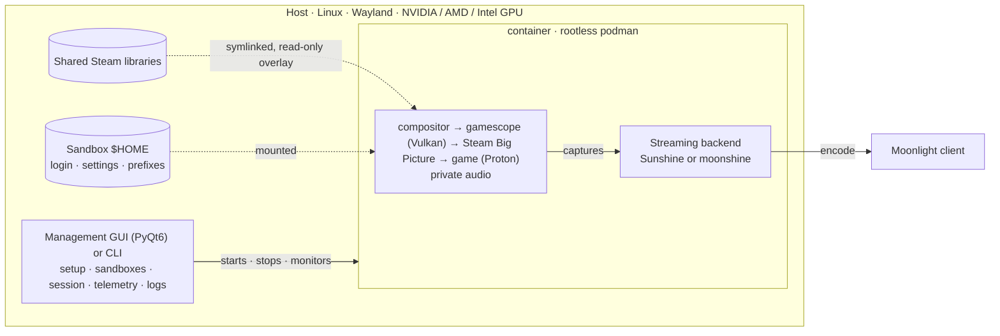
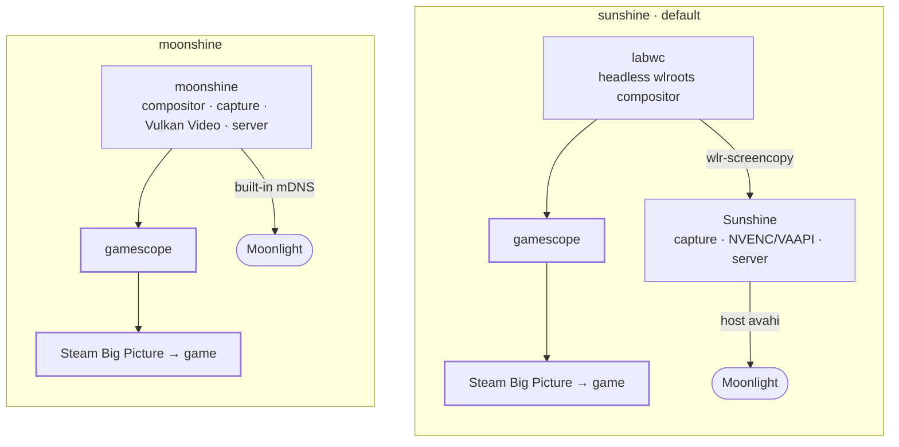
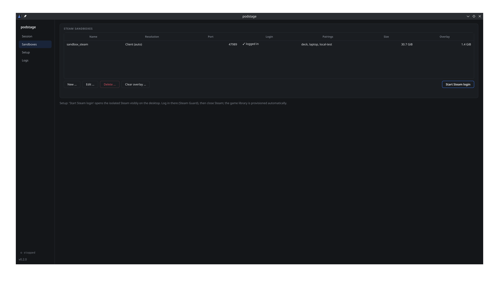
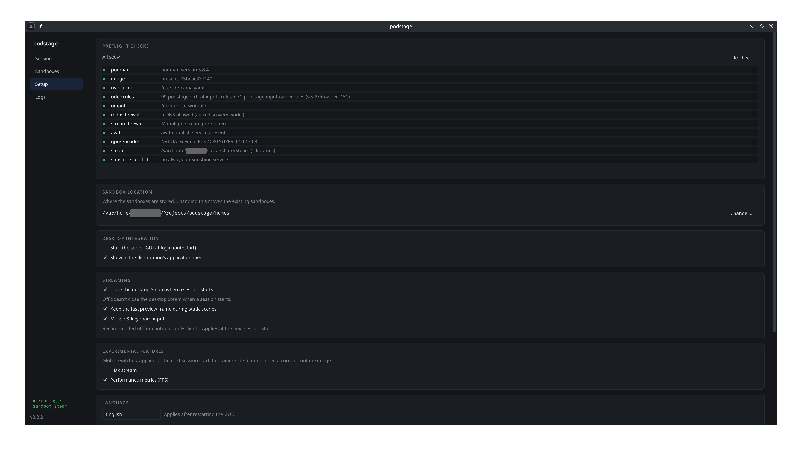

# podstage

**Play a game streamed to your Steam Deck (or any Moonlight client) while your
desktop keeps doing its own thing.**

podstage runs each stream as a headless, isolated Steam Big Picture session
inside a rootless container: its own display, audio, Steam login and settings,
but shared game downloads with your main install. The game renders on a nested
[gamescope](https://github.com/ValveSoftware/gamescope) display, and a
streaming backend captures and encodes only that session:
[Sunshine](https://github.com/LizardByte/Sunshine) or
[moonshine](https://github.com/hgaiser/moonshine). Your monitors,
your sound and your Steam config stay untouched.

A PyQt6 GUI on the host handles setup, sandboxes and sessions. Every step is
also a CLI command, including the first Steam login, so a machine without a
desktop works the same way.



## Why podstage

The idea came on the couch: my gaming PC playing YouTube on the TV while I
played on the Steam Deck, graphics down, fan roaring. The powerful machine sat
idle while the little one did the work.

Steam Remote Play and a plain Sunshine install mirror your desktop session:
streaming takes over the screen you are sitting at, grabs the audio, and shares
one Steam config and one logged-in account. podstage spins up a separate,
invisible session instead:

- The desktop keeps its monitors, audio and Steam settings, and stays usable
  while someone streams. (Desktop Steam closes on session start by default; a
  Setup toggle keeps it running, e.g. for a second account.)
- Input from the client stays inside the session, in both directions.
- Sandboxes sit side by side, each with its own login, Steam settings, Input
  layout and per-game presets. One per client, per account, or per use case.

A headless server like moonshine already isolates the stream. podstage drives
it as one of its two backends and adds the sandboxed Steam around it: isolated
login, games shared from your host libraries instead of downloaded twice, plus
the setup, provisioning and monitoring you would otherwise assemble by hand.

## What podstage does

podstage is an orchestrator. It writes no compositor, no encoder and no
streaming server; it assembles existing ones into one disposable session and
manages its lifecycle:

- **builds the runtime image**, the container that carries the whole session
  stack, so the host installs nothing but podman
- **creates sandboxes**, one isolated `$HOME` per client or account, with its
  own Steam login, settings and Input layout
- **provisions games**, symlinked from your host Steam libraries and mounted
  read-only, so nothing downloads twice and a session cannot write to host
  game files
- **wires the container to the machine**: GPU (CDI or `/dev/dri`), the host's
  32-bit GL and NGX libraries, input devices and `/dev/uinput`, the ports
- **starts and supervises the session**: compositor, gamescope, Big Picture,
  the streaming backend, plus a focus watchdog and a performance probe inside
  the container
- **handles what surrounds the stream**: sunshine/Moonlight pairing, mDNS, encoder
  settings, telemetry, the preview, and the first Steam login over the stream

Only one session runs at a time, by design. The container is disposable:
stopping a session tears it down, while the sandbox it used (Steam login,
settings, saves, prefixes) stays on disk and is what the next session starts
from.


```mermaid
flowchart LR
    subgraph host["Host · Linux · Wayland · NVIDIA / AMD / Intel GPU"]
        gui["Management GUI (PyQt6) or CLI<br/>setup · sandboxes · session · telemetry · logs"]
        libs[("Shared Steam libraries")]
        home[("Sandbox $HOME<br/>login · settings · prefixes")]
        subgraph container["container · rootless podman"]
            pipeline["compositor → gamescope (Vulkan) → Steam Big Picture → game (Proton)<br/>private audio"]
            backend["Streaming backend<br/>Sunshine or moonshine"]
            pipeline -->|captures| backend
        end
        gui -->|starts · stops · monitors| container
        libs -.->|symlinked, read-only overlay| pipeline
        home -.->|mounted| pipeline
    end
    backend -->|encode| moonlight["Moonlight client"]
```

gamescope plus Big Picture is settled, not a placeholder: Steam forces the
gamepad UI under gamescope, and gamescope provides the Xwayland environment,
fullscreen forcing and scaling the rest builds on. A desktop-UI session exists
in the runtime as a debug path, not as a way to play; the streamed first login
runs the normal Big Picture pipeline.

What is baked into the image vs. mounted at runtime, the exact run flags, and
how input hotplug works inside the container is in
[`containers/runtime/README.md`](containers/runtime/README.md).

## Built on

podstage bundles and drives upstream projects; none of them is forked or
patched. A few small helpers are its own code.

| | Component | Role |
|---|---|---|
| Host | [podman](https://podman.io) (rootless) | the sandbox itself: one container per session, running as your user, no daemon, no root |
| | Python ≥ 3.11 · [PyQt6](https://www.riverbankcomputing.com/software/pyqt/) | CLI, core and the management GUI |
| | udev rules · avahi | client input pinned to a dedicated seat, and the mDNS announcement for the Sunshine backend |
| | OverlayFS | host game libraries read-only, per-sandbox writes on top |
| Container | [gamescope](https://github.com/ValveSoftware/gamescope) | nested Vulkan compositor: Big Picture, fullscreen, resolution and scaling. Same on both backends |
| | Steam · [Proton](https://github.com/ValveSoftware/Proton) | the game session itself (`-gamepadui`) |
| | [Sunshine](https://github.com/LizardByte/Sunshine) | default backend: capture, hardware encode (NVENC/VAAPI), GameStream server |
| | [labwc](https://labwc.github.io) · [PipeWire](https://pipewire.org) | the Wayland output Sunshine captures, and a private audio graph, host audio untouched |
| | [moonshine](https://github.com/hgaiser/moonshine) | alternative backend: compositor, capture, Vulkan Video encode, mDNS and server in one Rust process, with its own PulseAudio |
| | `seat-shim.c` · `keeper.c` · `focus-nudge.c` · `perf-probe.c` | podstage's own helpers: the small pieces of glue that keep the stack above working together inside the rootless namespace |

## Streaming backends

How the picture is composited, captured and encoded is a per-profile choice.
Everything else stays the same, gamescope included: it renders the session on
both backends, and the game never sees a difference. What differs is everything
around it.


```mermaid
flowchart TB
    subgraph sun["sunshine · default"]
        direction TB
        s1["labwc<br/>headless wlroots compositor"] --> s2["gamescope"] --> s3["Steam Big Picture → game"]
        s1 -->|wlr-screencopy| s4["Sunshine<br/>capture · NVENC/VAAPI · server"]
        s4 -->|host avahi| s5(["Moonlight"])
    end
    subgraph moon["moonshine"]
        direction TB
        m1["moonshine<br/>compositor · capture · Vulkan Video · server"] --> m2["gamescope"] --> m3["Steam Big Picture → game"]
        m1 -->|built-in mDNS| m5(["Moonlight"])
    end
    classDef shared stroke-width:2px
    class s2,s3,m2,m3 shared
```

| | `sunshine` (default) | `moonshine` |
|---|---|---|
| encode | NVENC / VAAPI | Vulkan Video |
| GPU | any GPU with NVENC or VAAPI: NVIDIA, AMD, Intel (Broadwell+) | Vulkan video encode: NVIDIA RTX, AMD RDNA2+, Intel Arc |
| audio | private PipeWire | moonshine's own PulseAudio |
| discovery | host avahi | built-in mDNS |
| name in the client | `<profile>-sunshine` | `<profile>-moonshine` |
| pairing | web UI or CLI, TLS + login | CLI only, plain HTTP, no auth |
| quality settings | encoder presets in the GUI, applied live | error correction, applied at the next start |
| keyboard layout | host default | per profile (XKB layout/variant) |
| mouse & keyboard | per-install toggle | always streamed, no switch |
| render size | first client's mode, locked until restart | the connecting client's mode, per connect |
| stream preview in the GUI | wf-recorder on the labwc output | screenshot of the nested gamescope |
| image | `podstage-runtime` (about 3 GB) | `podstage-moonshine`, built on top of it |

**Sunshine** was the initial approach: labwc composites the session, Sunshine
captures that output through wlr-screencopy and encodes it with NVENC or VAAPI,
so it runs on anything with a hardware encoder. The cost is the plumbing
between the parts: a dedicated seat for the client's input devices, faked udev
hotplug in the rootless namespace, and a pointer capability held up so
gamescope keeps mouse input. Most of podstage's container work went there.

**moonshine** does all of it in one
process: compositor, capture, Vulkan Video encode, mDNS and GameStream server,
written in Rust (BSD-2-Clause) around the same idea podstage is built on. Steam
and gamescope sit on top unchanged, but the input layer below disappears,
because that compositor never opens an evdev device. At a high bitrate the
picture can flicker briefly in-game, at least on my machine; lowering it helps,
and the cause is still being investigated (see
[`containers/moonshine/README.md`](containers/moonshine/README.md)).

Both exist because neither is strictly better: Sunshine reaches every machine,
moonshine is the simpler path where the GPU allows it. Neither backend is
forked or patched; both are upstream projects the runtime bundles and drives.

```bash
podstage session add tv --backend moonshine
podstage runtime build --backend moonshine     # once, builds from source
podstage doctor                                # checks this GPU can encode
```

Both backends are checked on every `podstage doctor` run, whether a profile
uses them or not, so you can see whether this machine can do moonshine before
choosing it. The GUI does the same, with a *Build image* button per backend
group on the Setup page.

## Requirements

- Linux with a Wayland desktop. Developed on Bazzite-DX (Fedora-based, KDE
  Plasma); other modern distros should work.
- podman.
- A GPU with hardware video encode: NVIDIA (NVENC, via CDI injection), AMD or
  Intel (VAAPI via `/dev/dri`, Broadwell+ on Intel). The moonshine backend
  wants more, see [Streaming backends](#streaming-backends). The GUI adapts its
  encoder controls and telemetry to the detected vendor.
- Steam on the host; its libraries are shared into the sandboxes.
- Python ≥ 3.11 for the CLI and core. PyQt6 ≥ 6.6 only for the GUI, which is
  optional.
- A Moonlight client with a gamepad (Steam Deck, laptop, phone with
  controller); mouse and keyboard are a toggle.

> **Tested configuration.** Verified end to end on Bazzite-DX 43 (KDE Plasma,
> Wayland) with an NVIDIA RTX 4080 SUPER, streaming to a Steam Deck. AMD is
> validated on a Rembrandt iGPU, Intel confirmed by a community report (Arc
> B580). Other distros and non-KDE compositors are untested (see
> [Portability](#portability)); reports welcome.

## Getting started

```bash
git clone https://github.com/slooock-dev/podstage && cd podstage
python3 -m venv .venv && . .venv/bin/activate
pip install -e '.[ui]'       # core + CLI + GUI; drop [ui] for CLI only

podstage runtime build
```

### With the GUI

`./ui.sh`, then work three pages top to bottom:

1. **Setup**: every red or amber check has a fix button, root-gated ones open a
   pkexec prompt. Build the image, install the two udev rules, open the
   firewall: mDNS for auto-discovery, the profile's Moonlight port block for
   the stream itself. Everything after this runs without a password.
2. **Sandboxes**: create a profile (name, resolution, port, backend), then
   *Streamed login*: the sandbox boots into Big Picture's sign-in, so you pair
   Moonlight (step 3) and log in over the stream, without a window on the
   host. *Start Steam login* opens the isolated Steam on the desktop instead,
   for the settings Big Picture does not expose. Either way the library is
   provisioned automatically.
3. **Session**: pick the sandbox, *Start*, then *Pair* with the PIN Moonlight
   shows.

### Headless, from the CLI

```bash
podstage doctor                              # what is missing
podstage setup                               # prints the (sudo) setup commands
podstage session add deck --resolution 1280x800@60
podstage session login deck                  # first Steam login, over the stream
podstage session start deck
podstage session pair deck 1234              # PIN from Moonlight
```

Everything the GUI does is a command, the first Steam login included:
`session login` boots a fresh sandbox into Big Picture's sign-in over the
stream (QR code via the Steam Mobile App, or the on-screen keyboard), and Steam
bootstraps entirely in-container. The one step that still wants a desktop is
`session setup`, which opens the sandbox's Steam visibly on the host for
settings Big Picture does not expose.

## Managing a session

### The GUI

| Page | What it does |
|------|--------------|
| **Session** | Start and stop the stream, the running game, the Performance card (game FPS, plus GPU/VRAM/encoder and the whole machine's CPU and RAM), a live preview, pairing, and the backend's quality settings: NVENC or VAAPI presets on Sunshine, error correction on moonshine. |
| **Sandboxes** | Profiles including the streaming backend, per-sandbox status (login, paired clients, disk and overlay usage with cleanup), and both Steam-login paths (over the stream or on the desktop). |
| **Setup** | Doctor checks grouped by host, streaming and backend, each with a one-click fix; the one-time udev rules install, the sandbox location, desktop integration, streaming toggles (close the desktop Steam, mouse and keyboard, preview, performance metrics), experimental features, an update check, UI language, and the uninstaller. |
| **Logs** | Live journald tail of the runtime container. |

<p align="center">
  
  
</p>

English and German, following the system locale (override in Setup or via
`PS_LANG`). `./ui.sh` picks the interpreter that can `import PyQt6`
(`$PS_QT_PYTHON` overrides) and hands Qt's plugin path to the app in-process,
so child processes keep a clean environment.

### The CLI

```
podstage doctor                    # validate the environment
podstage setup                     # print guided (sudo) setup commands
podstage uninstall [--keep-sandboxes] [--all] [--dry-run]
podstage runtime build [--backend sunshine|moonshine]
podstage runtime start|stop|status # drive the container directly (by HOME dir)
podstage session list
podstage session add <name> [--resolution R] [--port N] [--backend B] [--apps ID,…] [--fixed-resolution] [--mount PATH[:rw]]…
podstage session login <name>      # streamed first login (Big Picture sign-in)
podstage session setup|start|stop|status <name>   # start: --resolution, --app
podstage session pair <name> <PIN>
podstage session remove <name> [--data] | clear-overlay <name>
podstage experimental [enable|disable <feature>]
podstage config mouse-keyboard|perf-metrics [on|off]
podstage desktop [menu|autostart [on|off]]
podstage provision <app_id> <session>
```

`podstage runtime start --home homes/deck --resolution 1280x800@60` is what
`containers/runtime/run.sh` wraps. Live container logs:
`journalctl -f CONTAINER_NAME=podstage-runtime`.

## Optimization

### Image quality

The encoder controls on the Session page (NVENC preset, two-pass and VBV on
NVIDIA, the VAAPI quality profile and rate control otherwise) only decide how
well the encoder spends the bitrate it is given. The bigger wins are on the
client and the network:

- **Raise the Moonlight bitrate.** The session streams what the client asks
  for, and Moonlight's default of 10-20 Mbps is low. On a LAN, try 50-100+
  Mbps. A washed-out, blocky picture in motion is almost always too little
  bitrate.
- **Prefer HEVC or AV1** over H.264 (Moonlight → Settings → Video codec). At
  the same bitrate HEVC looks noticeably better, AV1 better still. NVIDIA
  encodes all three; AMD and Intel cover H.264 and HEVC, with AV1 on newer
  GPUs.
- **Match the client's native resolution.** On Sunshine the session renders at
  whatever connects first and scales later clients; moonshine rebuilds the
  session per connect, so every client gets its own mode.
- **Prefer a wired host.** High bitrate over Wi-Fi suffers from packet loss.
  Wiring the host, or a clean 5 GHz link, often helps more than any encoder
  setting.

After that, tune the encoder on the Session page: on NVIDIA max the preset (P7)
and two-pass (full res), and raise VBV if fast motion still shows artifacts; on
AMD and Intel raise the VAAPI quality profile.

### Shader caching

Each sandbox keeps its own shader cache, so Steam's shader pre-caching costs
disk per sandbox instead of once per machine, and every sandbox waits through
its own "Processing Vulkan shaders" before a game starts.

On strong hardware, turn it off (sandbox Steam → Settings → Downloads). That
saves gigabytes per sandbox and skips the wait; DXVK and VKD3D compile on the
fly instead, which a capable CPU and GPU handle well, at the price of a brief
stutter on first run in a few titles.

## Security notes

**podstage is built for a local, trusted network.** The stream, the pairing
endpoints and Sunshine's web UI listen on your LAN and belong nowhere else.
Streaming requires a completed pairing on both backends; moonshine's PIN
endpoint has no authentication at all, which is upstream's design and nothing
podstage can tighten.

Everything runs as your user; after the one-time setup, nothing needs root. The
container is a compatibility sandbox, not a security boundary: it shares your
network and the real `/dev/uinput`. Your Steam libraries are read-only overlay
lowerdirs, so a hostile game cannot modify host game files and its writes stay
in per-sandbox storage. Otherwise treat games with the same trust you would on
the desktop.

The images are built locally, from a digest-pinned base, a sha256-verified
Sunshine package and a pinned moonshine commit.

## Troubleshooting

- **Big Picture is a black or flashing screen.** Steam's CEF needs ~450 MB of
  shared memory; podman's default `/dev/shm` is 64 MB, which crash-loops the
  renderer. The runtime sets `--shm-size=1g`. Keep it.
- **Big Picture takes controller input but focuses nothing.** Steam's UI lost
  its navigation focus, usually right after a game exits. A watchdog in the
  container re-focuses Steam's window and normally heals it; otherwise press B
  until the side menu opens. `PS_FOCUS_NUDGE=disabled` turns it off.
- **Client input controls the desktop, or the stream has no input.** Both udev
  rules must be installed: the seat rule pins the streaming devices to a
  dedicated seat, the generated owner rule makes them and `/dev/uinput`
  accessible to the container. Install both from the Setup page. If
  `/dev/uinput` stays unwritable afterwards, run
  `sudo udevadm trigger --sysname-match=uinput`.
- **Custom Proton (GE / CachyOS) hangs at launch** with a "non-Gamescope
  swapchain … hooking has failed" dialog. Nested gamescope fails GE's stricter
  WSI hook, so the runtime sets `DISABLE_GAMESCOPE_WSI=1`.
  `PS_GAMESCOPE_WSI=enabled` opts back in.
- **Moonlight can't auto-discover the host.** Open mDNS in the firewall
  (`firewall-cmd --add-service=mdns`, offered as a Setup fix). Pairing by IP
  always works, as long as the profile's Moonlight port block is open too,
  which Setup checks separately.
- **NVIDIA `vulkan_make_output failed` on start.** The CDI spec doesn't inject
  `/dev/nvidia-modeset`; the runtime adds it explicitly. Regenerating CDI
  (`nvidia-ctk cdi generate`) also fixes it.
- **No GPU load shown on Intel.** The meter samples `intel_gpu_top`; install it
  (igt-gpu-tools) and make the GPU PMU readable (CAP_PERFMON or a relaxed
  `perf_event_paranoid`). VRAM stays unavailable on i915/xe.
- **The preview stays blank.** On Sunshine the capture only produces a frame
  while the picture is changing; on moonshine there is nothing to capture until
  a client connects, because the compositor only exists then. The placeholder
  shows until the first frame arrives.
- **A game re-downloads the same update in every session.** Sandbox-side
  updates live in per-sandbox overlay storage
  (`~/.local/share/podstage/overlays/`) and are purged once the host updates
  the game past the sandbox. Update games on the host.

## Portability

podstage is developed on Fedora/Bazzite, and a few host assumptions reflect
that:

- The 32-bit NVIDIA GL libraries, the Xwayland GLX module and the driver's NGX
  DLLs (which is what makes DLSS work in the sandbox) are bind-mounted by
  absolute path. podstage searches the Fedora/Bazzite/Arch and Debian/Ubuntu
  locations; a distro that stores them elsewhere leaves Steam's 32-bit client
  UI without hardware GL.
- CDI GPU injection expects a spec at `/etc/cdi/nvidia.yaml`
  (`nvidia-ctk cdi generate`).
- AMD and Intel take `/dev/dri` and VAAPI instead, with ANV Vulkan and the iHD
  media driver (Broadwell+) baked into the image. The GUI follows: VAAPI
  encoder controls instead of NVENC ones, GPU load and VRAM from the amdgpu
  sysfs, or from `intel_gpu_top` on Intel, where VRAM stays unavailable because
  i915/xe expose no counters. `PS_GPU_VENDOR=intel` forces the path on hybrid
  machines.
- Validation differs per vendor: NVIDIA end to end, AMD on one Rembrandt iGPU
  streamed to a Steam Deck, Intel by a community report on an Arc B580. Intel
  iGPUs and pre-Broadwell parts are untested.

Patches widening distro and GPU support are very welcome.

## Uninstall

`podstage uninstall` (or Setup → *Remove podstage*) detects and removes
everything setup created: udev rules, firewall ports, the runtime images,
sandboxes, data, configuration, and the desktop integration. Shared pieces (the
mDNS firewall service, the NVIDIA CDI spec) are kept unless `--all`, since
other software uses them too.

## Related projects

[Games on Whales / Wolf](https://github.com/games-on-whales/wolf) is a
multi-client streaming platform built on the same isolation idea;
[Apollo](https://github.com/ClassicOldSong/Apollo) (a Sunshine fork) gives each
client its own virtual display on Windows. podstage sits above the
capture/encode layer either way: a complete containerized Steam Big Picture
session, ready to stream, including the sandboxed Steam login itself (done in
the stream, controller or QR code, no window on the host), one Linux gaming PC,
one stream at a time.

The streaming servers it drives are described under
[Streaming backends](#streaming-backends).

## Development

See [CONTRIBUTING.md](CONTRIBUTING.md) for the dev setup, the Qt/Python quirk
for the GUI, and the test workflow.

podstage is written with AI coding assistants. Everything is reviewed and
verified on real hardware before it lands, and CI runs `ruff` plus the test
suite on Python 3.11-3.13.

## License

MIT, see [LICENSE](LICENSE).
